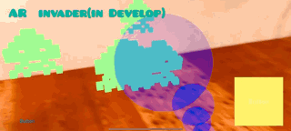

# ARKit-Invader

ARKit3 Hackathonで作成したデモアプリのソースコードです。制限時間内で作成した物なので、動作は保証出来ません。参考程度にどうぞ！

This is the source code of the demo app created with ARKit3 Hackathon.Since it is created within the time limit, the operation cannot be guaranteed.Please for reference...!

# How to build

1.Download this Repository.

2.Open `ARKit3Hackaton-ARInvader.xcodeproj` with Xcode 11 and build it.

# Contents

## AR Invader GAME

ゲームルール

1. インベーターを配置出来る。相手の配置したインベーターに自分が当たるとマイナスポイント。

2. インベーターを射撃で倒せる。相手の配置したインベーターを倒すとプラスポイント。

3. 1&2を繰り返して、100点を競う。

GAME RULE

1. You can place inbeta. Minus points if you hit the invader that the opponent placed.

2. Defeat the inbeta by shooting. Plus points when defeating the opponent's placed inbeta.

3. Repeat 1 & 2 and compete for 100 points....

# Details

[note (@1901drama)](https://note.mu/1901drama/n/n511ee6ad4615)

[GitHub (@1901drama)](https://github.com/1901drama/ARKit3Hackaton-ARInvader)

☆ (star), 👍 (like) etc. If you can give feedback, I will do my best, so thank you!
